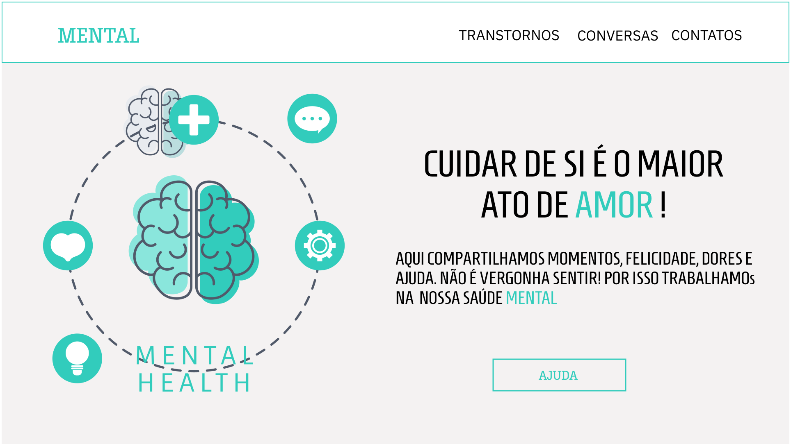

<h1 align="center">MENTAL</h1>

--- 

Mental is a website made to introdce about mental transtorns.

## User Stories

-   [ ] User can able to know some disorders.
-   [ ] User can see a cards with some story.
-   [ ] User can create and post your own story.
-   [ ] User can find institutes to seek help. 

## 💼 TECH 

In this project I used: 

- HTML;
- Sass;
- JavaScript;

---
